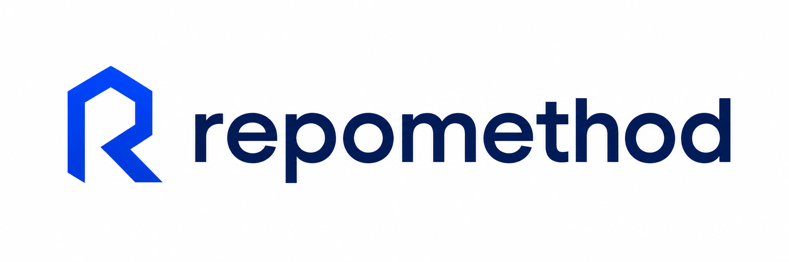

<div align="center">
  

[](https://github.com/frederik-schmittel/repomethod/actions/workflows/ci.yml)

</div>

**One install, and every coding agent works your repository the same way —
Claude Code or Codex, locally or in a cloud runner.**

RepoMethod puts one repository-native engineering method into your project.
Every agent reads the same scope, verification, and evidence rules from the
repository, enforced by real shell commands instead of chat context.

The defaults are fixed and opinionated, so a cold agent can start immediately.
They are plain files in your repository, so you can change them when needed.

Tested with Claude Code and Codex on macOS and Ubuntu.

## Install

Setup is one install and one repository-defined verification command.

```bash
npm install --global repomethod

cd /path/to/your-repo
repomethod doctor      # check the environment
repomethod install     # write the method into this Git repository
```

`repomethod install` writes into the current Git repository only; other repos
stay untouched. `repomethod update` and `repomethod uninstall` manage the
lifecycle later, always offline.

## 30-second example

```bash
repomethod install
echo "npm test" > .repomethod/verify-command       # the repository's real check

.repomethod/scripts/feature-workflow.sh classic init --feature my-feature \
  --verify-command ".repomethod/scripts/agent-gate.sh --spec specs/my-feature.md"

# after the agent implements the task, close it out through the same gate:
.repomethod/scripts/deliver.sh \
  --spec specs/my-feature.md \
  --state .repomethod/workflows/my-feature.json
```

If scope changed unexpectedly, an acceptance criterion is unchecked, evidence
is missing, or the repository's own tests fail, delivery fails — one
`DELIVERY: blocked — <reason>` line, non-zero exit.

## What an installed project gets

- one canonical contract, `.repomethod/AGENTS.md`, reached from a small
  marker-delimited pointer block in the host `AGENTS.md` / `CLAUDE.md`;
- three delivery modes — **Quick MVP**, **Classic Loop**, and an editable
  **Graph** — driven by `.repomethod/scripts/feature-workflow.sh`;
- the repository's own verification command (`.repomethod/verify-command`),
  made mandatory by the completion gate;
- deterministic gates for scope, forbidden content, reviewed plan obligations,
  acceptance criteria, evidence, protected paths, and that verification
  command, closed out with one command;
- persistent workflow state a second host can resume from a clean checkout;
- a manifest-aware install / update / uninstall lifecycle that preserves
  managed files you have edited.

## How it works

```text
coding agent
    ↓  AGENTS.md / CLAUDE.md pointer block
.repomethod/AGENTS.md            the contract every agent reads
    ↓  workflow state + spec
real shell verification          scope · prohibitions · plan obligations · acceptance · evidence · verify-command
    ↓
deterministic delivery verdict   done | blocked | incomplete
```

The shell runner never creates agents. Claude and Codex use their own worker
mechanisms while consuming the same node goals, dependencies, artifacts, and
verification results, so a task started locally resumes unchanged in the cloud.

## Delivery modes

```bash
.repomethod/scripts/feature-workflow.sh quick-mvp

.repomethod/scripts/feature-workflow.sh classic init --feature <slug> \
  --verify-command ".repomethod/scripts/agent-gate.sh --spec specs/<slug>.md"

.repomethod/scripts/feature-workflow.sh graph init --feature <slug> --research single \
  --verify-command ".repomethod/scripts/agent-gate.sh --spec specs/<slug>.md"
```

- **Quick MVP** prints a bounded contract (one slice, one test, one
  correction) and creates no state.
- **Classic** persists Implementation → command-backed Verification →
  Completion, with a bounded fix loop.
- **Graph** adds research and an execution graph the developer approves before
  implementation.

Full commands and state transitions:
[the workflow reference](blueprint/.repomethod/docs/WORKFLOW_GRAPH.md).

## Verification

RepoMethod detects no stack and guesses no build. The repository defines its
own check once in `.repomethod/verify-command`: every non-comment line runs,
in order, from the repo root, and all must exit 0.

`.repomethod/scripts/agent-gate.sh --spec <spec>` runs that check plus the
structural gates and trusts only their exit status:

- `verify.sh` — the configured command;
- `verify-scope.sh` — committed, staged, unstaged, and untracked files stay
  inside the spec's Scope and off protected paths;
- `verify-forbidden.sh` — an optional `## Must Not Exist` section rejects
  forbidden content in files whose paths match the spec's Scope;
- `plan-obligations.sh check` — if the spec declares `## Plan Obligations`
  entries, the current feature-scoped extraction must exist, match the spec and
  workflow mode when state is supplied, and be approved;
- `verify-acceptance.sh` and `verify-evidence.sh` — every criterion is checked
  and every referenced evidence file exists and is non-empty;
- `verify-report.sh` and `verify-invariants.sh` — enforced only when the spec
  declares a test-count command or integration invariants.

`Must Not Exist` declarations are fixed strings by default. Regular expressions
require the explicit `regex:` prefix and use POSIX extended regular-expression
syntax:

```md
## Must Not Exist

- `legacy_api(`
- regex: `legacy_[0-9]+\(`
```

The check scans tracked and non-ignored untracked regular files inside `Scope`,
including pre-existing code. It scans file contents verbatim, so comments and
docstrings count as matches. Unknown file types are scanned as well; scoped
symlinks and other non-regular Git entries fail closed.

Plan obligations are opt-in. Existing Classic/Graph specs with no active
declarations are unaffected, including specs that use a non-canonical path or
filename. When an existing feature is adding the first declaration under
`## Plan Obligations`, generate and review the extraction before the full gate:

```bash
.repomethod/scripts/plan-obligations.sh extract --mode <classic|graph> \
  --spec specs/<feature>.md --repo .
.repomethod/scripts/plan-obligations.sh approve --mode <classic|graph> \
  --spec specs/<feature>.md --repo . --revision <n> \
  --approval-text "<review evidence>"
```

Until that current revision is approved, `agent-gate.sh --spec` fails by
design. This is the migration step for features that opt into plan obligations.

`.repomethod/scripts/supervisor.sh check` turns a persisted workflow into a
deterministic verdict — `done`, `continue`, `blocked`, `needs_human`, or
`evidence-ignored`. `.repomethod/scripts/preflight.sh` is a read-only
environment check the gate runs first.

Close out through `.repomethod/scripts/deliver.sh` — `--quick` for Quick MVP,
`--spec <spec> --state <file>` for Classic and Graph. It maps the gate result
and that supervisor verdict to one line, `DELIVERY: done | blocked | incomplete
— <reason>`; only `done` exits 0.

## Roadmap

RepoMethod is evolving toward a repository-native control layer for the full
path from engineering intent to a verified pull request, while keeping the
agent runtime interchangeable.

Near-term work is tracked as concrete GitHub issues, in roughly the order it
unblocks the rest:

- **Local CI parity** ([#12](https://github.com/frederik-schmittel/repomethod/issues/12)) — make push-readiness locally reproducible with the same repository-owned checks CI executes.
- **Descope ledger** ([#2](https://github.com/frederik-schmittel/repomethod/issues/2)) — record every dropped plan obligation append-only and block delivery until each descope has a reviewed decision.
- **Contract-shape checks** ([#4](https://github.com/frederik-schmittel/repomethod/issues/4)) — compare the contract shapes a spec declares against the models the implementation actually builds.
- **Plan provenance** ([#5](https://github.com/frederik-schmittel/repomethod/issues/5)) — trace acceptance criteria and integration invariants back to reviewed plan obligations, and treat reviewed descopes as resolved rather than orphaned.
- **Plan conformance** ([#6](https://github.com/frederik-schmittel/repomethod/issues/6)) — require an independent full-diff conformance step before Graph completion.
- **Intent and artifact lineage** ([#14](https://github.com/frederik-schmittel/repomethod/issues/14)) — preserve the upstream purpose of a feature through spec, plan, implementation, and evidence.
- **Progressive agent context** ([#15](https://github.com/frederik-schmittel/repomethod/issues/15)) — keep the always-loaded agent contract small and retrieve workflow-specific knowledge only when needed.

Longer-term directions are deliberately recorded here before their interfaces are
fixed enough for implementation issues:

- **Action-time policy gates** — expose provider-neutral allow/block/needs-human controls that agent hosts can call before sensitive actions are performed.
- **Agent-method evaluations** — evaluate repository instructions, skills, and workflow behavior against repeatable engineering tasks without making RepoMethod the model runner.
- **Independent review and workflow observability** — structured review contracts, severity-aware findings, and durable evidence about how autonomous work reached its result.

These directions stay inside RepoMethod's product boundary: repository-owned
contracts, state, verification, and evidence rather than a hosted agent runtime,
deployment platform, or monitoring service.

## Boundaries

RepoMethod owns `.repomethod/` — one directory, nothing host-generic. Its
pointer block in `AGENTS.md` / `CLAUDE.md` is created, appended, or replaced in
place, and the file's permission mode is preserved.
RepoMethod never owns or intentionally modifies content outside its marker block.
That is what lets it sit next to an existing build system, CI, or another agent
framework without touching either.

No queue, daemon, database, UI, hosted service, or provider-specific agent
runtime. No automatic merge, release push, model selection, or token
accounting. Exactly one product path (`core`).

## Requirements

Node.js 18+ and npm for the CLI. Bash 4.4+, Git, and `jq` to install.
RepoMethod performs no network fetch of its own. Linux and macOS; Windows only
via WSL, untested.

## Development

Source checkouts can run `install.sh` / `update.sh` / `uninstall.sh` directly;
`--dry-run`, `--preserve`, `--backup`, and `--force` control how existing files
are handled.

```bash
bats tests/*.bats
shellcheck lib/*.sh install.sh update.sh uninstall.sh scripts/*.sh \
  blueprint/.repomethod/scripts/*.sh blueprint/.repomethod/skills/*/scripts/*.sh

./scripts/release.sh X.Y.Z   # gate + version bump + tag; never pushes
```
